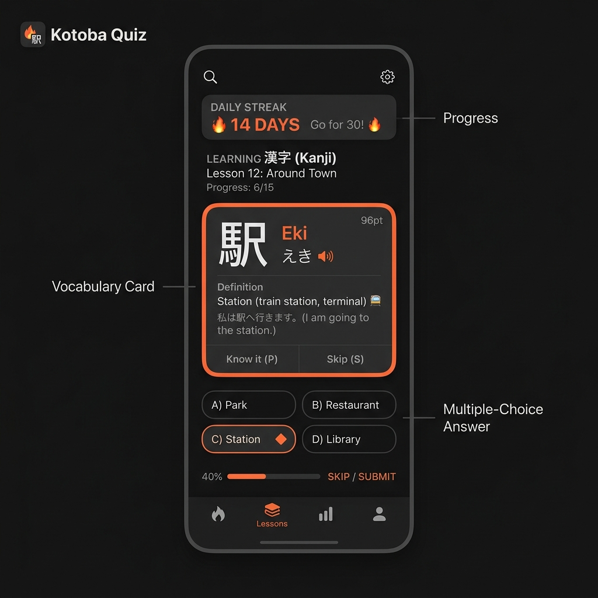

# 🎌 言葉カード — Kotoba Quiz

A beautiful, premium mobile-optimized flashcard application for learning Japanese vocabulary, built with Next.js, React 19, and Tailwind CSS. Features Google Sheets integration for automatic vocabulary synchronization, Firestore cloud backups, and full Capacitor compatibility for native mobile deployment.



## ✨ Fitur Utama

- **🎨 Desain Premium & Haptic-Like UI**: Antarmuka modern yang terinspirasi dari aplikasi pembelajaran bahasa premium seperti Bunpo, lengkap dengan mikro-animasi dan transisi mulus.
- **🔄 Spaced Repetition System (SRS)**: Sistem antrean kuis berbasis tingkat kepahaman (Level 0-6) untuk optimasi memori jangka panjang.
- **📊 Google Sheets Integration**: Kemudahan impor dan pembaruan database kosakata secara massal langsung dari Google Sheets (CSV).
- **☁️ Firebase Firestore Sync**: Sinkronisasi data kemajuan belajar secara instan dan aman di awan menggunakan Firebase Auth dan Firestore.
- **📱 Capacitor Native Platform**: Dirancang agar kompatibel penuh untuk dideploy menjadi aplikasi native di **Android** dan **iOS**.
- **🔔 Pengingat Harian Pintar**: Sistem notifikasi lokal (Local Notifications) yang secara otomatis akan menjadwalkan ulang notifikasi jika Anda sudah berlatih hari ini.
- **🔥 Streak & Progress Mingguan**: Pelacakan streak Duolingo-style lengkap dengan indikator aktivitas mingguan.

---

## 🛠️ Stack Teknologi

- **Framework**: [Next.js 16 (App Router)](https://nextjs.org/)
- **Library**: [React 19](https://react.dev/)
- **Styling**: [Tailwind CSS v4](https://tailwindcss.com/)
- **Native Wrapper**: [Capacitor v8](https://capacitorjs.com/)
- **Database & Auth**: [Firebase](https://firebase.google.com/) & [NextAuth.js](https://next-auth.js.org/)
- **Notifikasi**: [Capacitor Local Notifications](https://capacitorjs.com/docs/apis/local-notifications)

---

## 📋 Struktur Data & Kolom Google Sheets

Aplikasi ini menggunakan format Google Sheets dengan struktur **5 kolom**. Pastikan tabel Anda memiliki susunan header sebagai berikut:

| Kategori | Hiragana | Kanji | Arti | Bab |
| :--- | :--- | :--- | :--- | :--- |
| Kata Benda | わたし | 私 | Saya | Perkenalan |
| Kata Kerja | ねます | 寝ます | Tidur | Aktivitas |

> [!NOTE]
> Kolom ke-5 (`Bab`) digunakan untuk pengelompokan tingkat kemajuan di menu utama. Jika dikosongkan, kosakata akan dikelompokkan ke dalam kategori "Tanpa Bab".

### Langkah Menghubungkan Google Sheets:
1. Buat spreadsheet di Google Sheets sesuai dengan format kolom di atas.
2. Klik **File** → **Share** → **Publish to web**.
3. Pilih opsi **Entire Document** / sheet terkait, lalu ubah formatnya menjadi **Comma-separated values (.csv)**.
4. Klik **Publish** dan salin URL hasil publikasi tersebut.
5. Tempel URL tersebut pada halaman **Pengaturan** di aplikasi Kotoba Quiz Anda untuk sinkronisasi otomatis.

---

## 🚀 Memulai Pengoperasian Lokal

### Prasyarat
Pastikan Anda sudah menginstal [Node.js](https://nodejs.org/) (versi 18+ direkomendasikan) di komputer Anda.

### Langkah Instalasi
1. Clone repositori ini:
   ```bash
   git clone https://github.com/sarunk21/kotoba-quiz.git
   cd kotoba-quiz
   ```
2. Instal dependensi:
   ```bash
   npm install
   ```
3. Jalankan server pengembangan lokal:
   ```bash
   npm run dev
   ```
4. Buka [http://localhost:3000](http://localhost:3000) di browser Anda.

---

## 📱 Membangun Aplikasi Native Mobile (Capacitor)

Untuk menjalankan atau mem-build Kotoba Quiz sebagai aplikasi Android atau iOS:

1. Lakukan build proyek web Next.js terlebih dahulu:
   ```bash
   npm run build
   ```
2. Sinkronisasikan file build ke platform native:
   ```bash
   npx cap sync
   ```
3. Buka proyek di Android Studio atau Xcode:
   ```bash
   npx cap open android
   # atau
   npx cap open ios
   ```
