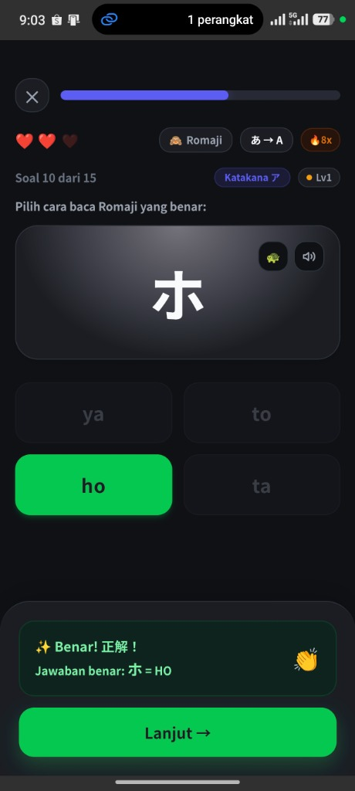
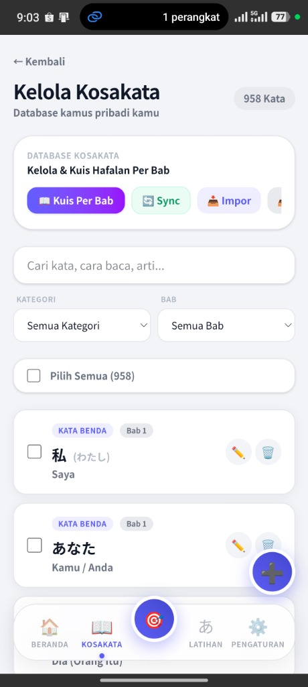
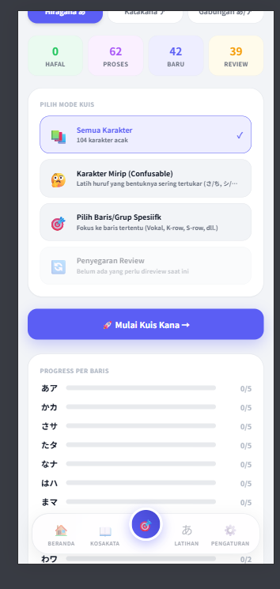

# 🎌 言葉カード — Kotoba Quiz

> **Aplikasi Flashcard & Kuis Bahasa Jepang Premium, Responsif, Offline-First & PWA / Capacitor Mobile App.**



---

## 🌟 Tampilan Real Aplikasi (App Screenshots)

<div align="center">
  <table border="0">
    <tr>
      <td width="33%" align="center">
        <b>🎮 Mode Kuis & Bottom Sheet Overlay Feedback</b><br/><br/>
        
      </td>
      <td width="33%" align="center">
        <b>📚 Kelola Kosakata & Database Google Sheets</b><br/><br/>
        
      </td>
      <td width="33%" align="center">
        <b>あ Kana Learning Hub & Progress Level SRS</b><br/><br/>
        
      </td>
    </tr>
  </table>
</div>

---

## ✨ Fitur-Fitur Unggulan (Key Features)

- **💬 Interactive Bottom Sheet Feedback (Duolingo Style)**:
  Setiap kuis (Kosakata SRS, Kana, Partikel, Susun Kalimat, & Latihan Bab) dilengkapi dengan **Overlay Sheet Melayang** di bagian bawah untuk feedback instan (`✨ Benar! 正解！` / `❌ Kurang Tepat`) dan kunci jawaban tanpa menggeser kartu pilihan.

- **🛡️ Modal Konfirmasi Keluar & Pencegahan Back accidental**:
  Mencegah pemain keluar dari kuis secara tidak sengaja (baik via tombol navigasi aplikasi maupun tombol *Back* fisik/gesture Android & iOS).

- **あ Kana Learning Hub & Weighted SRS Progress**:
  Sistem pembelajaran Hiragana & Katakana lengkap dengan audio pelafalan asli, latihan karakter mirip (*Confusable Kana*), serta indikator kemajuan granular (*Weighted Level 0-6 System*) yang langsung bertambah secara visual setelah tiap sesi latihan.

- **📖 2.200+ Soal Kuis Per Bab (Bab 1 – 25 Minna no Nihongo)**:
  Tersedia 2 kategori kuis per bab dengan pemilih topik (*Topic Selector Tabs*) yang bersih:
  1. **QUIZ Latihan A, B, C**: 1.300+ Soal Tata Bahasa & Struktur Kalimat.
  2. **QUIZ Kosakata**: 909 Soal Hafalan Kosakata dengan pilihan jawaban kustom bawaan dari Google Forms.

- **🔄 Spaced Repetition System (SRS) & Offline-First**:
  Menyimpan seluruh progres memori di `localStorage` dan secara otomatis disinkronkan ke **Firebase Firestore** saat online.

- **📊 Impor & Sinkronisasi Massal Google Sheets**:
  Mendukung impor dan pembaruan database kosakata pribadi secara massal cukup dengan menempelkan link CSV Google Sheets Anda.

- **📱 Full PWA & Capacitor Native Mobile Ready**:
  Dapat di-install sebagai **Progressive Web App (PWA)** dengan Service Worker offline, atau di-build menjadi aplikasi native Android & iOS via Capacitor.

---

## 🛠️ Stack Teknologi

- **Framework**: [Next.js 16 (App Router)](https://nextjs.org/)
- **Library**: [React 19](https://react.dev/)
- **Styling**: Vanilla CSS Design Tokens & Tailwind CSS v4
- **Native Mobile Wrapper**: [Capacitor v8](https://capacitorjs.com/)
- **Database & Sync**: [Firebase Firestore](https://firebase.google.com/) & [NextAuth.js](https://next-auth.js.org/)
- **Notification System**: Capacitor Local Notifications & Web Notifications Service Worker

---

## 📋 Format Database Google Sheets (5 Kolom)

Kotoba Quiz menggunakan format spreadsheet **5 kolom** standar berikut:

| Kategori | Hiragana | Kanji | Arti | Bab |
| :--- | :--- | :--- | :--- | :--- |
| Kata Benda | わたし | 私 | Saya | Bab 1 |
| Kata Kerja | ねます | 寝ます | Tidur | Bab 1 |
| Kata Sifat | おおきい | 大きい | Besar | Bab 2 |

> [!TIP]
> **Cara Sinkronisasi CSV Google Sheets**:
> 1. Buat spreadsheet sesuai 5 kolom di atas.
> 2. Di Google Sheets, pilih **File** ➔ **Share** ➔ **Publish to web**.
> 3. Ubah format dari *Web Page* menjadi **Comma-separated values (.csv)** lalu klik **Publish**.
> 4. Salin link publikasi CSV lalu tempel pada menu **Kelola Kosakata ➔ Link Google Sheets** di aplikasi Kotoba Quiz.

---

## 🚀 Memulai Pengoperasian Lokal (Local Setup)

```bash
# 1. Clone repositori
git clone https://github.com/sarunk21/kotoba-quiz.git
cd kotoba-quiz

# 2. Install dependensi
npm install

# 3. Jalankan server pengembangan lokal
npm run dev

# 4. Akses aplikasi di browser
# http://localhost:3000
```

---

## 📱 Membangun Aplikasi Native Mobile (Android & iOS)

```bash
# Lakukan build web terlebih dahulu
npm run build

# Sinkronkan aset build ke platform Capacitor
npx cap sync

# Buka proyek native di Android Studio atau Xcode
npx cap open android
# atau
npx cap open ios
```

---

<div align="center">
  <sub>Developed with ❤️ for Japanese Learners worldwide by <b>Sarunk</b></sub>
</div>
