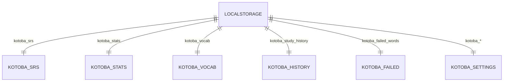
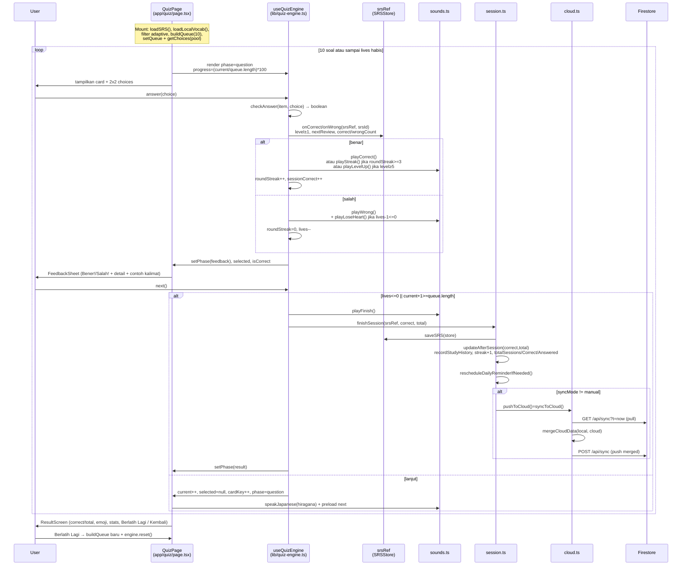
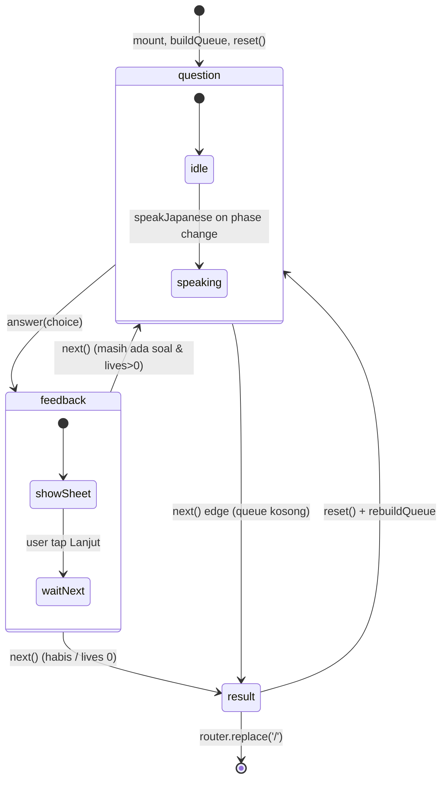
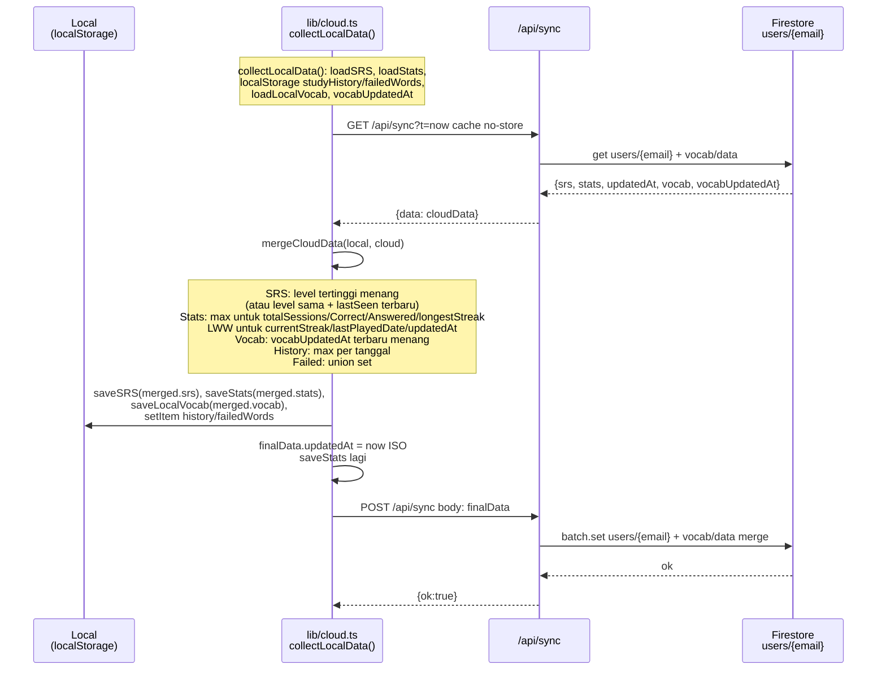
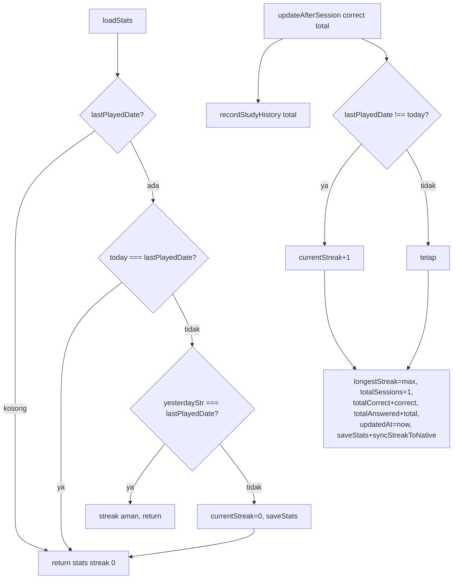
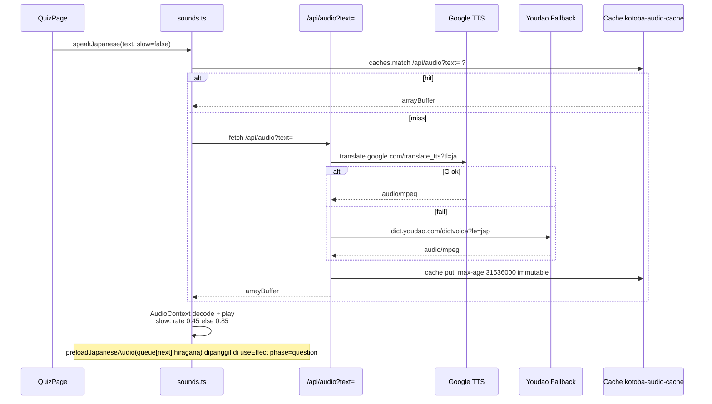

# Alur Data — Kotoba Quiz (言葉カード)

> **Sumber:** `lib/quiz-engine.ts:21-175`, `lib/srs.ts:1-258`, `lib/session.ts:12-33`, `lib/cloud.ts:1-321`, `lib/stats.ts:1-118`, `lib/vocab.ts:1-391`, `app/api/sync/route.ts:116`  
> **Prinsip:** Offline-first. `localStorage` adalah kebenaran, Firestore adalah mirror via **pull-merge-push**.

---

## Daftar Isi
1. [Gambaran Umum](#1-gambaran-umum)
2. [Model Data & ERD](#2-model-data--erd)
3. [Skema localStorage](#3-skema-localstorage)
4. [SRS — Level, Interval & Bobot](#4-srs--level-interval--bobot)
5. [Pembuatan Queue (buildQueue)](#5-pembuatan-queue-buildqueue)
6. [Alur Kuis Lengkap (Sequence)](#6-alur-kuis-lengkap-sequence)
7. [State Machine Quiz](#7-state-machine-quiz)
8. [Alur Load Vocab & Migrasi](#8-alur-load-vocab--migrasi)
9. [Cloud Sync — Pull-Merge-Push](#9-cloud-sync--pull-merge-push)
10. [Stats, Streak & Heatmap](#10-stats-streak--heatmap)
11. [Audio & Notifikasi](#11-audio--notifikasi)
12. [Failed Words & Special Modes](#12-failed-words--special-modes)
13. [API Contracts](#13-api-contracts)
14. [Diagram Ringkas End-to-End](#14-diagram-ringkas-end-to-end)

---

## 1. Gambaran Umum

```
┌─────────────┐     buildQueue      ┌──────────────┐    answer()     ┌─────────────┐
│  Vocab/Kana │ ──────────────────► │ useQuizEngine│ ──────────────► │  SRSStore   │
│  + SRSStore │     10 soal         │  queue[10]   │  onCorrect/     │  level+1/-1 │
└─────────────┘                     └──────┬───────┘  onWrong        └──────┬──────┘
                                           │ next()                         │ finish()
                                           ▼                                ▼
                                    ┌──────────────┐                 ┌──────────────┐
                                    │ FeedbackSheet│                 │ finishSession│
                                    │ ResultScreen │                 │ saveSRS      │
                                    └──────────────┘                 │ updateStats  │
                                                                     │ pushToCloud  │
                                                                     └──────┬───────┘
                                                                            │ syncToCloud
                                                                     ┌──────▼───────┐
                                                                     │  Firestore   │
                                                                     │ users/{email}│
                                                                     └──────────────┘
```

**Kunci:**
- **Pre-quiz:** `loadLocalVocab()` → filter (chapter/JLPT/failed/special) → `buildQueue(ids, store, 10)` → `queue`
- **In-quiz:** `answer(choice)` → `checkAnswer` → `onCorrect/onWrong` (mutasi `srsRef`) → sound → `next()`
- **Post-quiz:** `finishSession(store, correct, total)` → `saveSRS` + `updateAfterSession` + `rescheduleReminder` + `pushToCloud` (jika `auto`)

---

## 2. Model Data & ERD

### 2.1 Tipe Inti

```ts
// lib/vocab.ts:6
interface VocabItem {
  id: string                 // hash(category|hiragana|kanji|arti) — tanpa chapter!
  hiragana: string
  kanji: string
  arti: string
  category: Category         // 'Kata Benda'|'Kata Kerja'|...|'Angka'|... 
  chapter?: string           // 'Bab 1'..'Bab 25' | 'Tanpa Bab'
  contohKalimat?: string
  contohKalimatArti?: string
  source?: 'standard'|'custom'
  choices?: string[]         // untuk custom quiz (import-form)
}

// lib/srs.ts:11
interface WordProgress {
  id: string
  level: number              // 0–6
  nextReview: string         // YYYY-MM-DD (local)
  correctCount: number
  wrongCount: number
  lastSeen: string           // YYYY-MM-DD
}
type SRSStore = Record<string, WordProgress>

// lib/stats.ts:6
interface GameStats {
  currentStreak: number
  longestStreak: number
  lastPlayedDate: string     // YYYY-MM-DD
  totalSessions: number
  totalCorrect: number
  totalAnswered: number
  updatedAt: string          // ISO
}

// lib/kana.ts
interface KanaCard { id: string; hiragana: string; katakana: string; romaji: string; group: KanaGroup; groupLabel: string }

// lib/particles-data.ts
interface ParticleQuestion { id: string; sentence: string; translation: string; correct: string; options: string[4]; explanation: string }

// lib/sentences-data.ts
interface SentenceQuestion { id: string; indonesian: string; japanese: string; blocks: string[]; explanation: string }

// lib/cloud.ts:7
interface CloudData {
  srs: SRSStore
  stats: GameStats
  vocab?: VocabItem[]
  vocabUpdatedAt?: string
  studyHistory?: Record<string,number>
  failedWords?: string[]
  updatedAt: string          // stats.updatedAt
}
```

### 2.2 ERD — Firestore

```mermaid
erDiagram
    USER ||--|| SRS : "users/{email}"
    USER ||--|| STATS : "users/{email}"
    USER ||--o| VOCAB : "users/{email}/vocab/data"
    USER {
        string email PK
        string srs_json
        string stats_json
        string updatedAt
    }
    SRS {
        string id FK "vocabId | kana_hiragana_* | particle_* | sentence_*"
        int level 0-6
        string nextReview
        int correctCount
        int wrongCount
        string lastSeen
    }
    STATS {
        int currentStreak
        int longestStreak
        string lastPlayedDate
        int totalSessions
        int totalCorrect
        int totalAnswered
        string updatedAt
    }
    VOCAB {
        string id PK "hash"
        string hiragana
        string kanji
        string arti
        string category
        string chapter
    }
```

**Implementasi API:** `app/api/sync/route.ts:116` — `GET` baca `users/{email}` + `users/{email}/vocab/data`, `POST` batch `set(...,{merge:true})`, `DELETE` batch delete.

### 2.3 ERD — localStorage (Offline)



Detail tabel ada di `docs/CODING_STANDARD.md:7` & §3 di bawah.

---

## 3. Skema localStorage

| Key | JSON Shape | Akses via | Keterangan |
|---|---|---|---|
| `kotoba_srs` | `SRSStore` | `lib/srs.ts:34-54` | Cache `cachedSRSStore` in-memory |
| `kotoba_stats` | `GameStats` | `lib/stats.ts:51-67` | `checkAndResetStreak` saat load |
| `kotoba_vocab` | `VocabItem[]` | `lib/vocab.ts:128-168` | Seed `vocab-default.json` 958, auto-migrasi chapter korup |
| `kotoba_vocab_updated_at` | `ISO string` | `lib/cloud.ts:38` | Untuk merge vocab |
| `kotoba_study_history` | `Record<YYYY-MM-DD, number>` | `lib/stats.ts:69-80` | Heatmap 84 hari `app/page.tsx:50` |
| `kotoba_failed_words` | `string[] max 50` | `lib/failed.ts` | `recordFailedWord` move-to-end |
| `kotoba_sync_mode` | `auto\|manual` | `lib/session.ts:19` | Default `auto` (`!== 'manual'`) |
| `kotoba_lives_enabled` | `true\|false` | `lib/session.ts:30` | Default `true` (`!== 'false'`) |
| `kotoba_show_furigana` | `true\|false` | `app/quiz/page.tsx:125` | Default `true` |
| `kotoba_theme` | `light\|dark\|system` | `app/layout.tsx` inline | Script set `.dark` |
| `kotoba_reminder_enabled/time` | `bool/string HH:mm` | `lib/notifications.ts` | `scheduleDailyReminder` id 1 |
| `kotoba_last_user` | `email` | `app/page.tsx:283` | Isolasi akun login |
| `kotoba_groq_key` | `string` | `lib/gemini.ts` | Groq API key, fallback `kotoba_gemini_key` |
| `kotoba_sheets_url` | `URL` | `app/page.tsx:31` | Default export CSV |
| `kotoba_stories` | `ChapterStory[]` | `lib/stories.ts` | Cache cerita AI |
| `kotoba_sheets_sync_timestamp` | `ms` | `app/page.tsx:165` | Throttle 1 jam |

**Aturan:** Akses hanya via `lib/*`, load di `useEffect` (hindari hydration mismatch), `saveSRS` update `cachedSRSStore` sync.

---

## 4. SRS — Level, Interval & Bobot

### 4.1 Interval (`lib/srs.ts:7`)

```ts
export const SRS_INTERVALS = [0, 1, 3, 7, 14, 30, 90] // index = level
export const MAX_LEVEL = 6
export const MASTERED_LEVEL = 5  // 5–6 = Hafal
export const LEVEL_WEIGHTS = [0, 0.25, 0.45, 0.65, 0.85, 0.95, 1.0]
```

| Level | Status | Interval | Contoh `nextReview` jika benar hari ini |
|---|---|---|---|
| 0 | Baru | 0 hari | Hari ini (ulang) |
| 1 | Lv.1 | 1 hari | Besok |
| 2 | Lv.2 | 3 hari | 3 hari lagi |
| 3 | Lv.3 | 7 hari | Minggu depan |
| 4 | Lv.4 | 14 hari | 2 minggu |
| 5 | Hafal | 30 hari | Sebulan |
| 6 | Master | 90 hari | 3 bulan |

**Transisi:**
- Benar: `newLevel = min(level+1, 6)`, `nextReview = addLocalDateDays(SRS_INTERVALS[newLevel])`, `correctCount++`, `lastSeen=today` (`lib/srs.ts:68`)
- Salah: `newLevel = max(level-1, 0)`, `nextReview = today`, `wrongCount++` (`lib/srs.ts:85`)

### 4.2 Bobot Progress

```ts
// lib/srs.ts:178
pct = Math.round( sum(LEVEL_WEIGHTS[level]) / total *100 )
```
Digunakan di `calculateChapterProgress` & `getSRSSummary` untuk feedback visual langsung (naik 25% dari Lv0→1).

---

## 5. Pembuatan Queue (buildQueue)

**Lokasi:** `lib/srs.ts:109-172`

```mermaid
flowchart TD
    A[Input: vocabIds[] + SRSStore] --> B{Klasifikasi per id}
    B -->|wp undefined / level 0| N[NewWords]
    B -->|level 1-4 & nextReview <= today| D1[Due Belum Hafal]
    B -->|level 1-4 & nextReview > today| F1[Future Belum Hafal]
    B -->|level 5 & nextReview <= today| D5[Due Lv5]
    B -->|level 5 & nextReview > today| F5[Future Lv5]
    B -->|level 6 & nextReview <= today| D6[Due Lv6]
    B -->|level 6 & nextReview > today| F6[Future Lv6]
    D1 & N & F1 & D5 & F5 & D6 & F6 --> S[Shuffle tiap bucket]
    S --> O[dueIds = shuffle D1 + D5]
    S --> P[newIds = shuffle N]
    S --> Q[refreshIds = shuffle F1 + F5 + D6 + F6]
    O & P & Q --> R[Slice 0..10 → queue]
```

**Prioritas:** `Due Belum Hafal` > `Baru` > `Future Belum Hafal` > `Due Hafal Lv5` > `Future Hafal` > `Master due` > `Master future`.

**Pemanggil:**

```ts
// app/quiz/page.tsx:112
const { dueIds, newIds, refreshIds } = buildQueue(v.map(i=>i.id), store, 10)
const allIds = [...dueIds, ...newIds, ...refreshIds].slice(0, 10)
```

- Kana: `lib/srs.ts:251` `getKanaSummary` pakai `kana_hiragana_*` + `kana_katakana_*`
- Partikel/Kalimat: prefix `particle_` / `sentence_` sebelum masuk store.

---

## 6. Alur Kuis Lengkap (Sequence)

### 6.1 Diagram Sequence — Sesi 10 Soal



### 6.2 Detail `answer()` (`lib/quiz-engine.ts:58-106`)

```ts
const correct = checkAnswer(currentItem, choice) // app/quiz/page.tsx:184: choice===arti + recordFailedWord
setSelected(choice); setIsCorrect(correct); setPhase('feedback')
if(onAnswered) onAnswered(currentItem, correct)
if(srsEnabled && getSrsId) {
  const srsId = getSrsId(currentItem) // vocab id / kana_... / particle_... / sentence_...
  const prev = srsRef.current[srsId]?.level||0
  srsRef.current = correct ? onCorrect(...) : onWrong(...)
  // sound branching
}
setSessionAnswered(a=>a+1)
```

### 6.3 Detail `next()` & `finish()` (`lib/quiz-engine.ts:108-127`)

```ts
next = () => {
  if( (livesEnabled && lives<=0) || current+1>=queue.length) { finish(); return }
  setCurrent(c=>c+1); setSelected(null); setIsCorrect(null); setCardKey(k=>k+1); setPhase('question')
}
finish = () => {
  playFinish(); setPhase('result'); finishSession(srsRef.current, sessionCorrect, sessionAnswered)
  if(onFinish) onFinish(...)
}
```

### 6.4 Guard Back Button (`lib/quiz-engine.ts:45-54`)

```ts
useEffect(() => {
  if(phase!=='question' && phase!=='feedback') return
  window.history.pushState({inQuiz:true},'',location.href)
  const handlePop = () => { window.history.pushState({inQuiz:true},'',location.href); setShowExitConfirm(true) }
  window.addEventListener('popstate', handlePop)
  return () => window.removeEventListener('popstate', handlePop)
}, [phase])
```
Jangan tambah listener lain.

---

## 7. State Machine Quiz



**Phase enum:** `QuizPhase = 'question'|'feedback'|'result'` (`lib/quiz-engine.ts:10`).

---

## 8. Alur Load Vocab & Migrasi

```mermaid
flowchart TD
    A[loadLocalVocab() app/page.tsx:223] --> B{localStorage kotoba_vocab ada?}
    B -->|tidak| C[seed defaultVocabData 958<br/>public/data/vocab-default.json<br/>saveLocalVocab]
    B -->|ada| D{cachedVocab ada?}
    D -->|ya| E[return cachedVocab]
    D -->|tidak| F[JSON.parse raw]
    F --> G{ada chapter korup<br/>!startsWith Bab?}
    G -->|ya| H[auto-migrasi ke clean<br/>saveLocalVocab(defaultData)]
    G -->|tidak| I[setGlobalVocab + return]
    C --> J[setGlobalVocab]
    H --> J
    I --> J
    J --> K[filter adaptive:<br/>isKanji? isSpecial? mode failed?<br/>chapter? level? maxActiveChapter]
    K --> L[buildQueue 10 → queue]
```

- **ID hash:** `Array.reduce(hash) + btoa(rawId.substring(0,10))` (`lib/vocab.ts:90`), tanpa chapter.
- **CSV parse:** `Papa.parse` header detection `kategori|arti|bab` (`lib/vocab.ts:33`), kolom 5 wajib, `chapter` normalisasi `Bab N` jika angka.
- **Adaptive pool:** `getMaxActiveChapterNumber` (`app/quiz/page.tsx:63`) — cari chapter tertinggi yang sudah ada progress, filter `chapterNum <= maxActive`.

---

## 9. Cloud Sync — Pull-Merge-Push

### 9.1 Gambaran



### 9.2 Merge Detail (`lib/cloud.ts:46-113`)

```ts
// 1. SRS — per id
for (const [id, wp] of Object.entries(cloudSRS)) {
  const localWp = local.srs[id]
  if (!localWp || wp.level > localWp.level || (wp.level===localWp.level && wp.lastSeen > localWp.lastSeen))
    mergedSRS[id] = wp
}
// 2. Stats
cloudIsNewer = (cloudStats.updatedAt || '') > (local.stats.updatedAt || '')
if (local.lastPlayedDate && !cloud.lastPlayedDate) cloudIsNewer=false // proteksi data kosong
else if (!local.lastPlayedDate && cloud.lastPlayedDate) cloudIsNewer=true
mergedStats = {
  totalSessions: Math.max(local, cloud),
  totalCorrect: Math.max(local, cloud),
  totalAnswered: Math.max(local, cloud),
  currentStreak: cloudIsNewer ? cloud : local,
  longestStreak: Math.max(local, cloud),
  lastPlayedDate: cloudIsNewer ? cloud : local,
  updatedAt: cloudIsNewer ? cloud : local,
}
// 3. Vocab — terbaru menang
cloudVocabIsNewer = (cloud.vocabUpdatedAt||'') > (local.vocabUpdatedAt||'')
mergedVocab = cloudVocabIsNewer ? cloud.vocab : local.vocab
// 4. History — max per tanggal
for ([date,count] of Object.entries(cloudHistory)) mergedHistory[date]=Math.max(local[date]||0, count)
// 5. Failed — union
mergedFailed = Array.from(new Set([...localFailed, ...cloudFailed]))
```

### 9.3 Fungsi Sync

| Fungsi | Deskripsi | Dipanggil |
|---|---|---|
| `collectLocalData()` | Kumpulkan 6 sumber lokal + `updatedAt` | internal |
| `mergeCloudData(local, cloud)` | Pure function, no side effect | `syncToCloud`, `pullFromCloud`, `importFromDrive` |
| `syncToCloud()` | Pull → merge → save lokal → POST push | `finishSession` (auto), `app/page.tsx:390` auto-sync login, pull-to-refresh |
| `forcePushToCloud()` | Direct POST tanpa pull (bahaya overwrite) | Jarang |
| `pushToCloud = syncToCloud` | Alias legacy aman | `lib/session.ts:6` |
| `pullFromCloud()` | Pull + merge + save, tanpa push | Manual refresh |
| `resetCloudData()` | DELETE `/api/sync` + hapus lokal | Settings reset |
| `importFromDrive()` | GET `/api/sync/import-drive` → merge → push Firestore | Settings import |

**Throttle & buster:** `t=Date.now()` query, `cache:'no-store'`, `next:{revalidate:0}` di Sheets/Audio.

---

## 10. Stats, Streak & Heatmap

### 10.1 Streak (`lib/stats.ts:27-118`)



- **Heatmap:** `app/page.tsx:50` `StudyHeatmap` 84 hari (12×7), color `0:gray-100`, `1-5:indigo-100`, `6-15:indigo-300`, `>15:indigo-600`, legend `Kurang→Lebih`.
- **Bridge native:** `lib/streak-bridge.ts` `syncStreakToNative` dispatch `CustomEvent 'kotoba_streak_updated'` + `Capacitor StreakWidgetPlugin.updateStreak`.

### 10.2 Summary (`lib/srs.ts:212-258`)

```ts
getSRSSummary(ids, store) // dueCount, newCount, masteredCount, learningCount, total, pct, accuracyPct
getKanaSummary(KANA, store) // 2× ids (hiragana+katakana)
```
Dipakai di Beranda tabs `vocab|kanji|kana` (`app/page.tsx:414`).

---

## 11. Audio & Notifikasi

### 11.1 TTS (`lib/sounds.ts` + `app/api/audio/route.ts:66`)



Web Audio oscillator untuk `playCorrect` (C5-E5-G5-C6), `playWrong` (sawth descend), `playStreak` (6-note arpeggio), `playLevelUp` (fanfare), `playFinish`, `playTap`, `playLoseHeart`.

### 11.2 Notifikasi (`lib/notifications.ts`)

- `checkNotificationNeeds()` → `streak_at_risk` (kemarin main, hari ini belum), `streak_lost` (>1 hari absen), `reminder` — tampil banner Duolingo-style `app/page.tsx:522`.
- `scheduleDailyReminder(hour=20)` id 1 via Capacitor `LocalNotifications` atau Web `Notification` — dipanggil `rescheduleDailyReminderIfNeeded()` di `finishSession` & `doSync`.

---

## 12. Failed Words & Special Modes

- **Failed:** `recordFailedWord(id)` move-to-end cap 50, `removeFailedWord(id)` saat benar, `getFailedWords()` → filter `pool = vocab.filter(id∈failedSet)` untuk `mode=failed` (`app/quiz/page.tsx:151`).
- **Kana confusable:** `lib/kana.ts` `CONFUSABLE_KANA_GROUPS` 8 grup (あ/お, シ/ツ...), `getConfusableDistractors` prioritaskan distractor mirip di `getChoices`.
- **Partikel:** `generateQuestions(p)` 5 benar +5 distractor seimbang, SRS `particle_${id}`, `speakJapanese(sentence)`, `addFuriganaToSentence` + `extractVocabRef`.
- **Kalimat:** `availableBlocks` shuffle, `selectedBlocks` tap order, `join('')` cek.

---

## 13. API Contracts

| Method | Endpoint | Auth | Request | Response | File |
|---|---|---|---|---|---|
| `GET` | `/api/sync?t=` | `auth()` email 401 | — | `{data:{srs,stats,updatedAt,vocab,vocabUpdatedAt}}` | `app/api/sync/route.ts:116` |
| `POST` | `/api/sync` | `auth()` 401 | `CloudData` JSON | `{ok:true}` | batch set merge |
| `DELETE` | `/api/sync` | `auth()` 401 | — | `{ok:true}` | batch delete |
| `GET` | `/api/sync/import-drive` | `accessToken` 401 | — | `{data:{srs,stats,...}}` 404 jika no file | `import-drive/route.ts:67` drive `appDataFolder/kotoba_data.json` |
| `GET` | `/api/sheets?url=&t=` | — 400 jika bukan `docs.google.com/spreadsheets` | — | `text/csv` | `sheets/route.ts:34` `User-Agent KotobaQuiz/1.0`, `&_=` buster |
| `GET` | `/api/audio?text=` | — 400 jika kosong | — | `audio/mpeg` `Cache-Control max-age=31536000,immutable` | `audio/route.ts:66` Google → Youdao |
| `GET` | `/api/import-form?url=` | — 400 jika bukan `forms` | — | `{id,title,description,questions:CustomQuestion[]}` | `import-form/route.ts:149` parse `FB_PUBLIC_LOAD_DATA_` |
| `GET` | `/api/auth/google-client-id` | — | — | `{clientId}` | `google-client-id/route.ts:7` |

**Auth:** `auth.ts:77` — `Google` OAuth + `Credentials google-native` (`tokeninfo?id_token` validasi `iss` & `email_verified`).

---

## 14. Diagram Ringkas End-to-End

```mermaid
flowchart LR
    subgraph Client[Browser / Capacitor]
        A[Beranda<br/>loadStats/SRS/vocab<br/>heatmap WOTD]
        B[Quiz Engine<br/>queue 10<br/>answer/next/finish]
        C[localStorage<br/>kotoba_*]
        D[SW<br/>public/sw.js<br/>+ audio cache]
    end
    subgraph Server[Next.js API]
        E[/api/sync<br/>pull-merge-push/]
        F[/api/sheets<br/>CSV proxy/]
        G[/api/audio<br/>TTS/]
        H[/api/import-form<br/>Forms/]
        I[NextAuth<br/>Google/]
    end
    subgraph Cloud
        J[(Firestore<br/>users/{email})]
        K[(Google Drive<br/>appDataFolder)]
        L[(Google Sheets)]
        M[(Google TTS / Youdao)]
    end

    A <--> C
    B <--> C
    C <--> E
    E <--> J
    K <--> E
    F <--> L
    G <--> M
    D --- C
    I --- J
```

**Catatan offline-first:** Semua panah ke `Server/Cloud` adalah opsional — app tetap berfungsi penuh tanpa mereka. Sync hanya enrich.

---

*Lihat juga `docs/CODING_STANDARD.md` (aturan koding) & `docs/UI_THEME.md` (token) & `docs/ARCHITECTURE.md` (struktur & deploy).*
